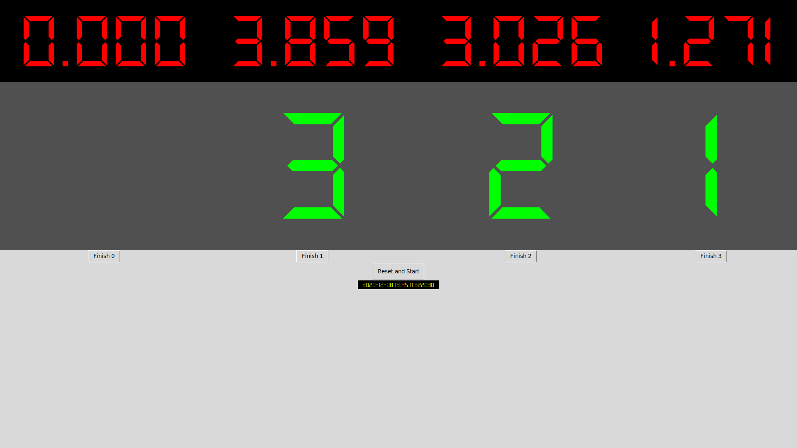

# Pi-wood-Derby
Pinewood Derby scoring system using a Raspberry Pi

This supports four tracks and provides a graphical output showing the times and finishing places.

The starting gate and each track can be high **or** low. They each get triggered when they flip state, high-to-low or low-to-high. This should hopefully make construction and code reuse much easier.

A duplicate start event gets ignored if it occurs too soon after the previous start event. This is useful if your gate is momentary or if the sensor is noisy.

A duplicate finish event gets ignored if one has already occurred for that track since the race start. This is useful if a skinny or transparent car crosses an optical sensor multiple times, for example.

Five GPIO pins are used:
Purpose | BCM Port | Physical Port (on 40 pin header)
--------|----------|--------------
Starting Gate | 26 | 37
Track 0 Finish | 22 | 15
Track 1 Finish | 23 | 16
Track 2 Finish | 24 | 18
Track 3 Finish | 25 | 22

